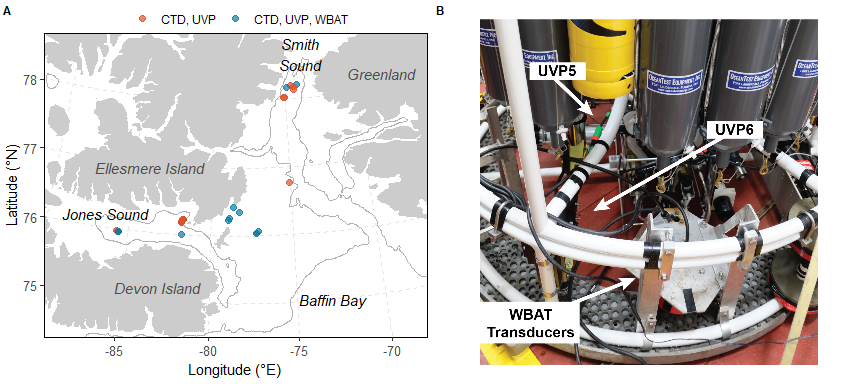

Amundsen 2021 - Analyses
================
Pierre Priou - <pierre.priou@mi.mun.ca>
2022-01-18

``` r
# Load packages
library(tidyverse)                # Tidy code
library(lubridate)                # Date handling
library(kableExtra)               # Pretty tables
library(cowplot)                  # Multiple plots
library(png)                      # Read png files
library(rgdal)                    # Read shapefiles
library(marmap)                   # Bathymetry data of the Arctic Ocean
library(scales)                   # Plots with dates
library(stringr)                  # Work with strings
library(MetBrewer)                # Colour palettes
library(cmocean)                  # Colour palettes
source("R/sv_correction_fm.R")    # Correct Sv vertical profiles
# Suppress summarise() warning
options(dplyr.summarise.inform = F)
# Theme for figures
theme_set(theme_bw())
theme_update(panel.grid = element_blank(), 
             panel.border = element_blank(), 
             axis.line = element_line(),
             axis.text = element_text(size = 10),
             axis.title = element_text(size = 11),
             legend.title = element_text(size = 11),
             strip.text.x = element_text(size = 11, face = "plain", hjust = 0.5),
             strip.background = element_rect(colour = "transparent", fill = "transparent"),
             legend.margin = margin(0,0,0,0),
             legend.box.margin = margin(0,0,-8,0),
             plot.margin = unit(c(0.05,0.05,0.05,0.05), "in"))
```

# Introduction

Diel vertical migrations (DVM) from ocean’s depth to the surface are a
ubiquitous pattern of pelagic organisms of the global ocean (Cohen
2009). While DVM are ultimately driven by predator-prey interactions
(e.g., Urmy et al. 2021), environmental factors are known to define the
extent and timing of these migrations. For example, temperature and
oxygen can influence DVM patterns (Bianchi et al. 2013, Benoit-Bird et
al. 2015?), but light penetration is considered to trump those other
environmental cues (Asknes et al. 2017). Fish living in the mesopelagic
zone, where the light intensity is between 10<sup>-9</sup> to
10<sup>-1</sup> μmol quanta m<sup>2</sup> s<sup>-1</sup> (Kaartvedt et
al., 2019), track a narrow range of ambient light levels—their light
comfort zone (Rostad 2016)—and migrate vertically following those
isolumes during the day-night cycle. They track their antipredation
window, which enhance their feeding chances while reducing mortality
through predation (Clark & Levy, 1988).

In the Arctic, the extreme light regime has the potential to disrupt
traditional DVM patterns, which could prevent the establishment of
viable mesopelagic fish populations in the Arctic (Kaartvedt 2008). Yet,
DVM can occur during the polar night at low light levels (Berge et
al. 2009) and mesopelagic fish are not as seldom in the Arctic as
previously thought, and are, in fact, widespread in high Arctic Seas
(Priou et al. *in prep*). However, their survival mechanisms remain
elusive. For most of the year mesopelagic fish remain segregated from
their favourite preys (Gjøsæter et al. 2017, Knutsen et al. 2017,
Geoffroy et al. 2019, Priou et al. 2021). Autumn has been suggested to
be a key period for feeding of mesopelagic fish, as the photoperiod
alternates between day and night—favouring large scale DVM—and their
copepod preys occupy most of the water column (**ref**).

The goals of this study were two-fold, (1) investigate whether
mesopelagic organisms conduct DVM in autumn, and (2) if those organisms
were associated to a specific range of ambient light levels matching
those of the global ocean. Here, we deployed a combination of acoustic,
optical, and environmental sensors and nets to document the vertical
distribution of pelagic fish and zooplankton in northern Baffin Bay in
autumn. We test the hypothesis that pelagic organisms follow a narrow
range of light levels (different from the “new” definition of the
mesopelagic zone) and thus conduct DVM.

# Materials and methods

``` r
# Load data
load("data/CTD/DarkEdge_CTD.RData") # CTD data
bathy <- read_csv("data/bathy/bathy_BaffinBay_-105-45;65;82_res2.csv") %>%
  mutate(depth_d = factor(case_when(between(depth, -50, Inf) ~ "0-50",
                                    between(depth, -100, -50) ~ "50-100",
                                    between(depth, -200, -100) ~ "100-200",
                                    between(depth, -500, -200) ~ "200-500",
                                    between(depth, -1000, -500) ~ "500-1000",
                                    between(depth, -Inf, -1000) ~ "1000-2500"),
                          levels = c("0-50", "50-100", "100-200", "200-500", "500-1000", "1000-2500")))
coast <- readOGR("data/bathy/ne_10m_land.shp", verbose = F) %>% # Coastlines
  fortify() %>%
  rename(lon = long,
         region = id)
glacier <- readOGR("data/bathy/ne_10m_glaciated_areas.shp", verbose = F) %>% # Glaciers
  fortify() %>%
  rename(lon = long,
         region = id)
```

The CCGS *Amundsen* surveyed northern Baffin Bay between between October
12 and 27, 2021 (Figure 1) during the DarkEdge campaign. We deployed our
instruments at three stations, north of Coburg Island, in Smith Sound,
and Jones Sound in varying sea ice conditions (Figure 1).

## Environmental data

A Seabird SBE911+ Conductivity Temperature Depth sensor (CTD) collected
vertical profiles of temperature, salinity, and pressure. The CTD
rosette was also equipped with an oxygen sensor (Seabird SBE43), a
transmissometer (Wetlab Cstar), two fluorimeters (Seabird SCF and ECO
CDOM), two PAR sensors (one underwater Biospherical Instruments PAR-QCP
2300, and surface Biospherical Instruments PAR-QCP 2200), and a nitrate
sensor (Satlantic). We only considered downcast data. A total of 40 CTD
casts were collected.

## Acoustic data

Broadband acoustic backscatter was recorded between 36-45 kHz and
283-333 kHz with a Simrad WBAT mounted on the CTD rosette (Figure 1B).
The transducers were facing sideward, pulse length was set to 2048 μs,
and ping rate to 0.5 Hz (Figure 1A, Table S1). The WBAT was activated
with a pressure switch at 8 m depth. On October 18<sup>th</sup> the
pressure switch malfunctioned and we therefore synchronized clocks of
the WBAT and CTD to associate backscatter measurements to depth.

Acoustic data was analyzed with Echoview 12. WBAT acoustic backscatter
data was manually inspected and cleaned. Data within the near-field was
excluded—4.00 m between 36-45 kHz and 1.75 m between 283-383 kHz. Using
pulse compressed data, we exported mean volume backscatter strength (Sv;
dB re 1 m<sup>-1</sup>) and nautical area scattering coefficient
(s<sub>A</sub>; m<sup>2</sup> nmi<sup>-2</sup>) at a resolution of 1
ping per 1 m range.

``` r
# Load WBAT data
WBAT_raw <- list.files("data/acoustics/WBAT", pattern = "*.csv", full.names = T) %>% 
  set_names() %>%
  map_dfr(.f = read.csv, .id = "filename") %>% # reads file
  rename("range" = "Layer_depth_min", "frequency" = "Frequency") %>%
  unite(date_WBAT, Date_S, Time_S, sep = " ", remove = F) %>%
  mutate(station = str_extract(filename, pattern = "DE[0-9]{3}"),
         CTD_id = str_extract(filename, pattern = "[0-9]{7}"),
         date_WBAT = round_date(ymd_hms(date_WBAT, tz = "UTC"), "second"),
         UTC = str_extract(filename, pattern = "UTC")) %>% # WBAT clock was either off by 4 hours or was in UTC
   mutate(date_ref_CTD = first(subset(CTD, round(depth) == 8)$date),
          diff_date = first(date_WBAT) - date_ref_CTD,
          date = if_else(is.na(UTC) == T, date_WBAT - diff_date, date_WBAT)) %>%
  dplyr::select(station, CTD_id, date, frequency, range, Sv_mean, NASC)
```



**Figure 1. A** Location of the stations in northern Baffin Bay where
the CTD, UVP, and WBAT were deployed (coloured dots). The solid grey
line represents the 500 m isobath. **B** WBAT with sideward facing
transducers, UVP5. and UVP6 installed on the CTD rosette.

**FREQUENCY RESPONSES**

## Zooplankton data

-   **UVP**

## Light data

-   **C-OPS**

# Random thoughts

-   What would be the consequence on mesopelagic fish if there are more
    autumn blooms in the Arctic?

# Appendix

<table class=" lightable-classic" style="font-family: Arial; margin-left: auto; margin-right: auto;">
<thead>
<tr>
<th style="text-align:left;font-weight: bold;">
Instrument
</th>
<th style="text-align:left;font-weight: bold;">
Transducer
</th>
<th style="text-align:center;font-weight: bold;">
Beam
</th>
<th style="text-align:center;font-weight: bold;">
Mode
</th>
<th style="text-align:center;font-weight: bold;">
Frequency (kHz)
</th>
<th style="text-align:center;font-weight: bold;">
Power (W)
</th>
<th style="text-align:center;font-weight: bold;">
Pulse length (µs)
</th>
<th style="text-align:center;font-weight: bold;">
Ramping
</th>
<th style="text-align:center;font-weight: bold;">
Ping rate (Hz)
</th>
<th style="text-align:center;font-weight: bold;">
Filter type
</th>
<th style="text-align:center;font-weight: bold;">
FM mode
</th>
</tr>
</thead>
<tbody>
<tr>
<td style="text-align:left;">
EK80
</td>
<td style="text-align:left;">
ES38-7
</td>
<td style="text-align:center;">
Split
</td>
<td style="text-align:center;">
CW
</td>
<td style="text-align:center;">
38
</td>
<td style="text-align:center;">
2000
</td>
<td style="text-align:center;">
1024
</td>
<td style="text-align:center;">
Fast
</td>
<td style="text-align:center;">
max
</td>
<td style="text-align:center;">
</td>
<td style="text-align:center;">
</td>
</tr>
<tr>
<td style="text-align:left;">
EK80
</td>
<td style="text-align:left;">
ES120-7C
</td>
<td style="text-align:center;">
Split
</td>
<td style="text-align:center;">
CW
</td>
<td style="text-align:center;">
120
</td>
<td style="text-align:center;">
250
</td>
<td style="text-align:center;">
1024
</td>
<td style="text-align:center;">
Fast
</td>
<td style="text-align:center;">
max
</td>
<td style="text-align:center;">
</td>
<td style="text-align:center;">
</td>
</tr>
<tr>
<td style="text-align:left;">
WBAT
</td>
<td style="text-align:left;">
ES38-18DK
</td>
<td style="text-align:center;">
Split
</td>
<td style="text-align:center;">
FM
</td>
<td style="text-align:center;">
36-45
</td>
<td style="text-align:center;">
450
</td>
<td style="text-align:center;">
2048
</td>
<td style="text-align:center;">
?
</td>
<td style="text-align:center;">
0.5
</td>
<td style="text-align:center;">
?
</td>
<td style="text-align:center;">
?
</td>
</tr>
<tr>
<td style="text-align:left;">
WBAT
</td>
<td style="text-align:left;">
ES333-7CDK
</td>
<td style="text-align:center;">
Single
</td>
<td style="text-align:center;">
FM
</td>
<td style="text-align:center;">
283-383
</td>
<td style="text-align:center;">
50
</td>
<td style="text-align:center;">
2048
</td>
<td style="text-align:center;">
?
</td>
<td style="text-align:center;">
0.5
</td>
<td style="text-align:center;">
?
</td>
<td style="text-align:center;">
?
</td>
</tr>
</tbody>
</table>

**Table S1.** Settings of the ship-borne echosounder (Simrad EK80) and
acoustic probe (Simrad WBAT) used during the DarkEdge campaign in
October 2021.
